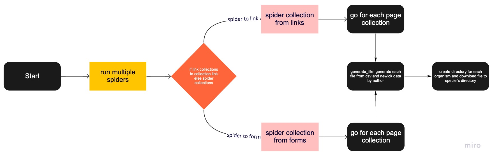

# Spyder
 
 

 
 
 

## Requirements
### Language and framework
- Python 3+
- Scrapy 2.5.0

#### Main files
- collections.py
    - It is responsable for scraping csv data from form on each collection.
- collections_from_link.py
    - It is responsable for scraping csv and newick data from each collection.

#### Common files
- generate_file.py
    - It is responsable for create directories and files saving csv and newick data.
- save_csv_file.py
    - It is responsable for create csv files with data from collections.
- save_nwk_file.py
    - It is responsable for create newick file with tree from collections.
- generate_author_id_year.py
    - It is a function responsable for return a tuple with 3 params: author, id and year to create directory name.
- mount_url.py
    - It is a function responsable for return mounted url to scrap data from collection page.
- organisms.py
    - It is a constant to return a tuple of organism and its ids.
### Server System Requirements
- Ubuntu Server
- 24GB Memory Ram or 16GB
- 1TB Disk

## Used
- Open terminal of your operational system.
- Verify Python version and installation with `python --version` by terminal.
- If not installed run `sudo apt update` and `sudo apt install python3.8` .
- Verify pip (manager python's libraries) version and installation with `pip --version` by terminal.
- If not installed run `sudo apt install python3-pip` .
- Verify git (manager repository) version and installation with `git --version` by terminal.
- If not installed run `sudo apt install git` .
- Create a directory for your project
    - `mkdir <your directory_name>` .
- Into your directory
    - `cd <your directory>` .
- Before clone git repository you need to setup ssh-key [GitHub instructions](https://docs.github.com/en/github/authenticating-to-github/connecting-to-github-with-ssh)
- Clone repository to local. `git clone https://github.com/lcerdeira/Spyder.git` .
- Into to repository cloned.
    - `cd Spyder` .
- After that run command `pip install -r requirements.txt` to install required modules.
- Now you stay at main directory. Run `scrapy crawl collections` on terminal to start webscraping to collecting csv.
- Now you stay at main directory. Run `scrapy crawl collections_from_link` on terminal to start webscraping to collecting newick.
- The downloaded files will appear on files directory automatically created.

### Flow Diagram

## API

### How to use
After downloaded and generated some files by spider you can see some file by API.

- First you need to go api directory. `cd api`
- Run command `uvicorn main:app`
- Now use any browser to see `http://localhost:8000/docs`. The result must be which appear on GIF.

